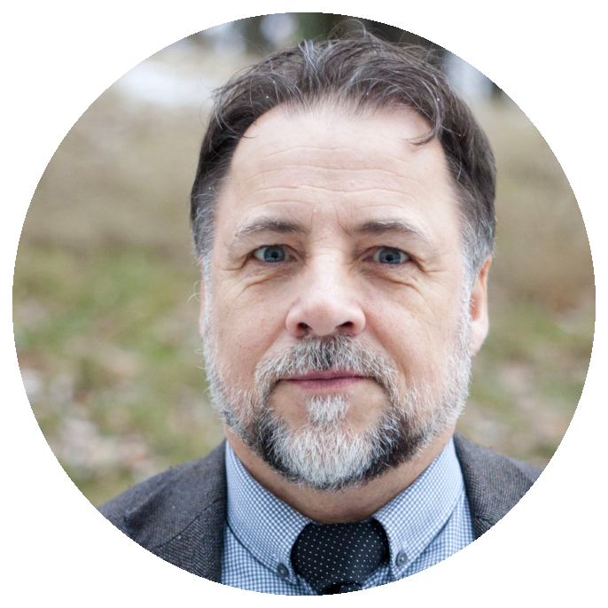
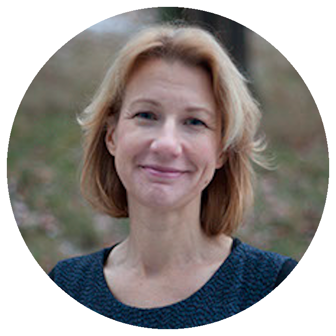
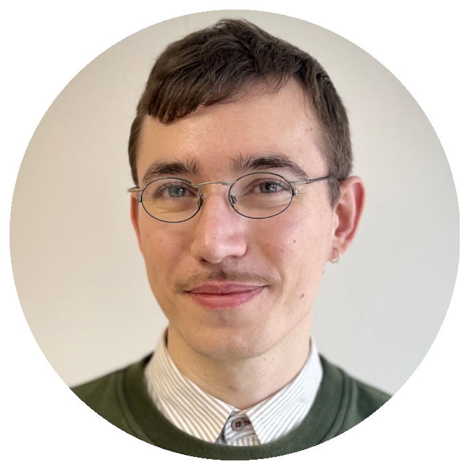

# Om oss {-}

{height=300px width=auto}

<b>Jan O. Jonsson</b> är professor i sociologi vid Institutet för social forskning (SOFI), Stockholms universitet, samt vid Institutet för framtidsstudier, och är knuten till Nuffield College, Universitetet i Oxford. Sedan 2007 sitter han i Kungliga vetenskapsakademien (KVA). Hans forskning gäller bland annat social ojämlikhet, integration samt barn och ungas levnadsvillkor. Han är ansvarig för den svenska delen av forskningsprojektet CILS4EU vars intervjuer med unga denna bok är baserad på.

{height=300px width=auto}

<b>Carina Mood</b> är professor i sociologi vid Institutet för social forskning (SOFI), Stockholms universitet, samt affilierad till Institutet för framtidsstudier. Hennes forskning rör främst fattigdom och levnadsförhållanden, samt forskningsmetoder. Hon är medansvarig för de svenska levnadsnivåundersökningarna och den svenska delen av CILS4EU, samt sedan 2019 invald i Kungliga vetenskapsakademien (KVA)

{height=300px width=auto}

<b>Georg Treuter</b> är forskningsassistent vid Institutet för social forskning (SOFI), Stockholms universitet, och går en forskarutbildning i nationalekonomi vid Tinbergen Institute, Amsterdam. Hans forskningsintressen är utbildning, social ojämlikhet och integration.

{height=300px width=auto}

<b>Andreas Gustafsson</b> är forskningsassistent vid Institutet för social forskning (SOFI), Stockholms universitet med en studiebakgrund inom biologi och sociologisk demografi. Hans forskningsintressen är familjedemografi med fokus på barns och ungas familjeförhållanden.